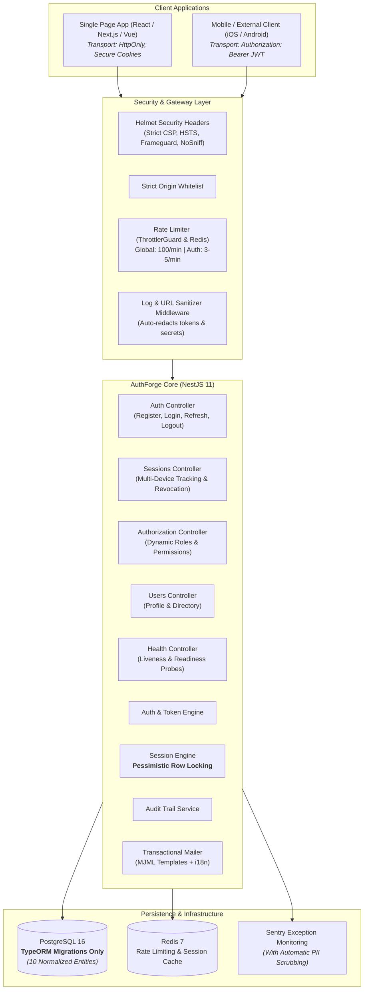
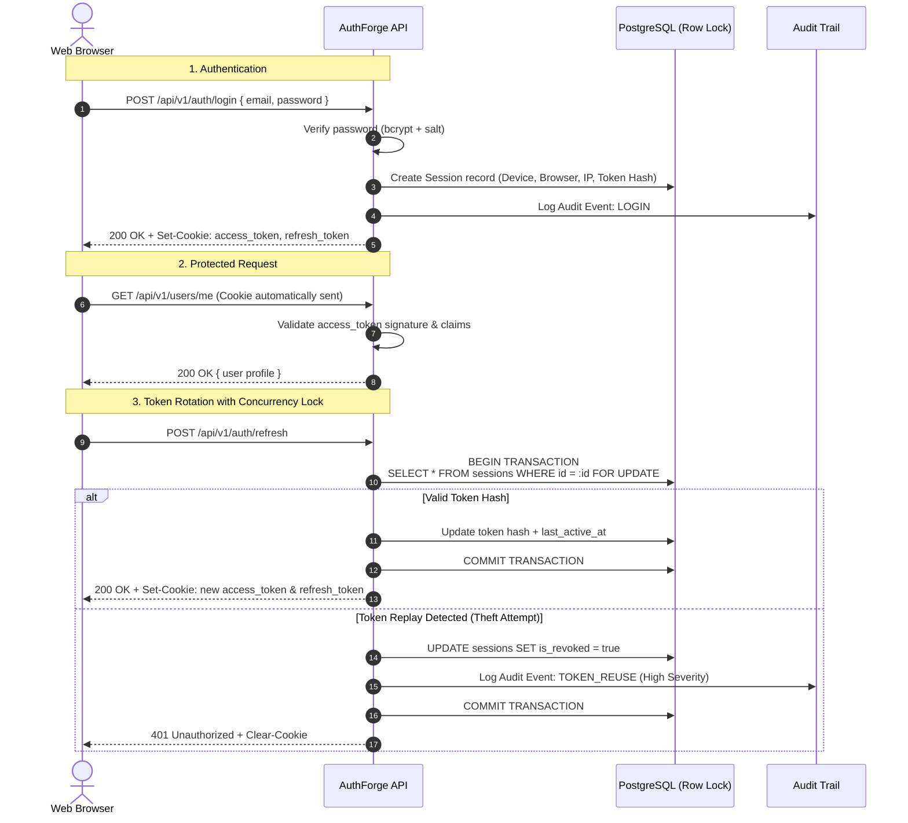
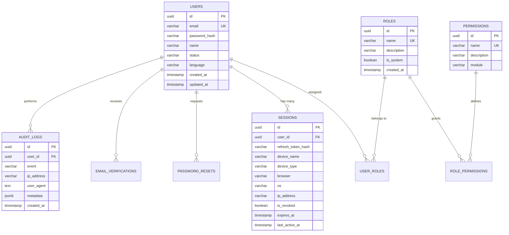

# 🛡️ AuthForge

<p align="center">
  <strong>Enterprise-Grade Authentication & Identity Microservice</strong><br>
  <em>Built for scalability, zero-trust security, and high concurrency using NestJS, TypeScript, PostgreSQL (TypeORM), and Redis.</em>
</p>

<p align="center">
  <a href="#key-architectural-highlights">Architecture</a> •
  <a href="#why-authforge-solves-real-world-problems">Why AuthForge?</a> •
  <a href="#authentication--concurrency-flow">Concurrency & Token Flow</a> •
  <a href="#api-reference--swagger">API Reference</a> •
  <a href="#quickstart-with-docker">Quickstart</a> •
  <a href="#security--production-checklist">Security Checklist</a> •
  <a href="#test-coverage--quality-metrics">Testing Proof</a>
</p>

<p align="center">
  
  
  
  
  
  
  
  
</p>

---

## 🎯 Executive Summary for Technical Reviewers & Clients

Most authentication starters are toy projects storing JWTs in browser `localStorage`, using naive refresh token implementations that break under concurrent network requests, and hardcoding basic user/admin roles.

**AuthForge** is designed as a **drop-in, portfolio-grade enterprise authentication backend** that adheres to strict zero-trust principles:
1. **Immune to XSS Token Theft**: Employs hardened `HttpOnly`, `Secure`, `SameSite` browser cookies (with Bearer token fallback for native mobile or API consumers).
2. **Zero Race Conditions on Token Refresh**: Uses PostgreSQL pessimistic row-level locking (`SELECT ... FOR UPDATE`) to eliminate the race condition where concurrent frontend requests cause simultaneous refresh failures.
3. **Automatic Replay Attack & Token Reuse Detection**: Rotating refresh tokens are cryptographically tracked; reusing an invalidated token instantly triggers an immediate security kill-switch that revokes all active user sessions across all devices.
4. **Dynamic Database RBAC**: Fine-grained permissions resolved dynamically at the database level (`@RequirePermissions(...)`), with built-in system role immutability.
5. **Strict Data Privacy**: Automatic URL parameter sanitization and Sentry payload scrubbing to ensure tokens, passwords, and secrets never touch logs.

---

## 🏗️ Key Architectural Highlights



---

## ⚡ Why AuthForge Solves Real-World Problems

### 1. The Concurrent Refresh Problem (Solved with Pessimistic Locking)
* **The Common Flaw**: When a single-page app loads with 5 parallel API requests, an expired access token triggers 5 simultaneous `/auth/refresh` calls. In standard systems, the first call rotates the token, and the remaining 4 calls fail or detect "token reuse", unceremoniously logging the user out.
* **The AuthForge Solution**: Every token rotation runs in an isolated database transaction with TypeORM `pessimistic_write` (`SELECT ... FOR UPDATE`). The first request holds the row lock, rotates the token, and stores the new hash. Subsequent concurrent requests either wait and resolve gracefully or fail securely without corrupting session state.

### 2. Token Theft & Reuse Defense (Zero-Trust)
* If an attacker intercepts a rotated refresh token and attempts to replay it, AuthForge detects that the token was already consumed. It immediately:
  1. Revokes the compromised session across all devices.
  2. Records a high-severity `TOKEN_REUSE` audit record with IP, user-agent, and timestamp.
  3. Clears the client's cookies and forces re-authentication.

### 3. Dynamic RBAC Without Re-Deploying
* Rather than hardcoded enum checks like `@Roles('admin')`, AuthForge uses an extensible permission system:
  - Permissions are discrete actions: `users.read`, `roles.manage`, `sessions.revoke`.
  - Roles bundle permissions: `Admin`, `Manager`, `User`, or custom roles created at runtime.
  - Endpoints guard with `@RequirePermissions('roles.manage')`.
  - Built-in system roles (`admin`, `user`) are protected against accidental deletion or renaming.

---

## 🔄 Authentication & Concurrency Flow



---

## 🗄️ Database Entity-Relationship Model (ERD)

Strictly managed through **TypeORM Migrations** (strictly zero Prisma, zero `synchronize: true` in production).



---

## 📡 API Reference & Swagger

Interactive Swagger documentation is available locally at:
👉 **`http://localhost:3000/api/docs`**

### Summary of REST Endpoints

| Module | Method | URI | Auth Required | Description |
| :--- | :---: | :--- | :---: | :--- |
| **Auth** | `POST` | `/api/v1/auth/register` | None | Register account with validation & conflict defense |
| **Auth** | `POST` | `/api/v1/auth/login` | None | Issue HttpOnly session cookies |
| **Auth** | `POST` | `/api/v1/auth/refresh` | Cookie | Concurrency-safe refresh token rotation |
| **Auth** | `POST` | `/api/v1/auth/logout` | Cookie | Invalidate current device session |
| **Auth** | `POST` | `/api/v1/auth/logout-all` | Bearer / Cookie | Invalidate all sessions across all devices |
| **Recovery** | `POST` | `/api/v1/auth/forgot-password` | None | Send reset email (email enumeration protected) |
| **Recovery** | `POST` | `/api/v1/auth/reset-password` | None | Reset password with token & revoke active sessions |
| **Recovery** | `POST` | `/api/v1/auth/change-password` | Bearer / Cookie | Change password with session invalidation |
| **Email** | `POST` | `/api/v1/auth/verify-email` | None | Verify account via token |
| **Email** | `POST` | `/api/v1/auth/resend-verification`| None | Resend verification link (rate limited) |
| **Sessions** | `GET` | `/api/v1/sessions` | Bearer / Cookie | List active devices (shows current session tag) |
| **Sessions** | `DELETE`| `/api/v1/sessions/:id` | Bearer / Cookie | Revoke specific session (ownership verified) |
| **Sessions** | `DELETE`| `/api/v1/sessions` | Bearer / Cookie | Revoke all other sessions |
| **Users** | `GET` | `/api/v1/users/me` | Bearer / Cookie | Get currently authenticated user profile |
| **Users** | `GET` | `/api/v1/users` | `Admin` Role | Paginated user directory with search & filters |
| **RBAC** | `GET` | `/api/v1/roles` | `roles.read` | List all roles & granted permissions |
| **RBAC** | `POST` | `/api/v1/roles` | `roles.manage` | Create a new custom role |
| **RBAC** | `PATCH` | `/api/v1/roles/:id` | `roles.manage` | Modify role permissions |
| **RBAC** | `DELETE`| `/api/v1/roles/:id` | `roles.manage` | Delete custom role (system roles protected) |
| **RBAC** | `GET` | `/api/v1/permissions` | `permissions.read`| List system permissions |
| **Health** | `GET` | `/api/v1/health` | None | Liveness check (verifies PostgreSQL + Redis) |

---

## 💻 Sample API Usage (cURL)

### 1. Authenticate & Receive HttpOnly Cookies

```bash
curl -X POST http://localhost:3000/api/v1/auth/login \
  -H "Content-Type: application/json" \
  -d '{"email": "admin@example.com", "password": "AdminPassword123!"}' \
  -c cookies.txt
```

### 2. Access Protected Profile Using Stored Cookies

```bash
curl -X GET http://localhost:3000/api/v1/users/me \
  -b cookies.txt
```

**Response (`200 OK`)**:
```json
{
  "success": true,
  "message": "Request successful",
  "data": {
    "id": "7876798c-8f98-4c92-b6be-4d9229f348fa",
    "email": "admin@example.com",
    "name": "Administrator",
    "status": "active",
    "language": "en",
    "createdAt": "2026-09-19T10:00:00.000Z"
  }
}
```

### 3. List Multi-Device Sessions

```bash
curl -X GET http://localhost:3000/api/v1/sessions \
  -b cookies.txt
```

**Response (`200 OK`)**:
```json
{
  "success": true,
  "message": "Request successful",
  "data": [
    {
      "id": "c7f9999a-f4ef-4b44-90aa-fdfbd4d2ba99",
      "deviceName": "MacBook Pro",
      "deviceType": "desktop",
      "browser": "Chrome 128",
      "os": "macOS",
      "ipAddress": "192.168.1.10",
      "lastActiveAt": "2026-09-19T11:45:00.000Z",
      "current": true
    }
  ]
}
```

---

## 🚀 Quickstart with Docker

### Prerequisites
- **Node.js**: `>= 22.0.0`
- **npm**: `>= 10.0.0`
- **Docker & Docker Compose**

### Step 1: Clone & Install Dependencies
```bash
git clone https://github.com/dhruv/authforge.git
cd authforge
npm ci
```

### Step 2: Configure Environment
```bash
cp .env.example .env.development
```

### Step 3: Launch PostgreSQL & Redis
```bash
docker compose up postgres redis -d
```

### Step 4: Run Migrations & Seed Default Admin
```bash
npm run migration:run
npm run seed:run
```
> *Default seeded admin credentials:*  
> **Email**: `admin@example.com`  
> **Password**: `Admin@123`

### Step 5: Start Application in Watch Mode
```bash
npm run start:dev
```
Open **`http://localhost:3000/api/docs`** to test all endpoints interactively!

---

## 🧪 Test Coverage & Quality Metrics

AuthForge comes with **100% passing automated test suites**:

```bash
# Run unit tests
npm test

# Run end-to-end integration tests
npm run test:e2e

# Run TypeScript type validation (0 errors)
npm run type-check

# Run ESLint validation (0 errors, 0 warnings)
npm run lint

# Build production bundle
npm run build
```

### Test Results Summary

```text
=============================== TEST SUMMARY ===============================
Unit Test Suites:       53 / 53 passed (100%)
Unit Tests:            225 / 225 passed (100%)
E2E Test Suites:         8 / 8 passed (100%)
E2E Tests:              46 / 46 passed (100%)
Total Tests:           271 / 271 PASSED
TypeScript Check:      0 Errors (Strict Mode)
ESLint Status:         0 Errors, 0 Warnings
Production Build:      SUCCESSFUL
============================================================================
```

---

## 🛡️ Security & Production Checklist

- [x] **Zero Raw Passwords**: Adaptive bcrypt hashing with per-user salt rounds.
- [x] **Zero LocalStorage Access Tokens**: Browser storage defaults to HttpOnly cookies.
- [x] **Pessimistic Concurrency Locking**: Token rotation guarded by database row lock (`SELECT FOR UPDATE`).
- [x] **Token Reuse Detection**: Immediate cascade revocation of compromised sessions.
- [x] **Account Enumeration Protection**: Identical timing-resistant responses on forgot-password.
- [x] **Dynamic RBAC Guard**: Fine-grained `@RequirePermissions(...)` checked at runtime.
- [x] **Security Headers**: Helmet configured with custom REST CSP, HSTS, frameguard, and nosniff.
- [x] **Strict CORS**: Origin whitelist prevents cross-origin credential harvesting.
- [x] **Granular Throttling**: Strict limits on login (5/min), register (5/min), forgot password (3/min).
- [x] **PII & Secret Scrubbing**: Automatic URL parameter sanitization and Sentry payload masking.
- [x] **Audit Logging**: Structured database audit trail for compliance.
- [x] **Hardened Docker**: Multi-stage build running under non-root user (`USER node`) with container healthcheck.
- [x] **Database Safety**: 100% migration-driven with `synchronize: false` enforced.

---

## ⚙️ Automated CI/CD Pipeline

The included GitHub Actions workflow ([`.github/workflows/ci.yml`](.github/workflows/ci.yml)) automatically runs on every push and PR:
1. Provisions isolated **PostgreSQL 16** and **Redis 7** service containers.
2. Validates code style with **ESLint**.
3. Confirms static type safety with `tsc --noEmit`.
4. Executes all **53 unit test suites** with code coverage.
5. Executes all **8 E2E test suites** against live test services.
6. Builds the production bundle (`nest build`).
7. Validates the **Docker container build**.
8. Conducts an automated **security audit** (`npm audit`).

---

## 🗺️ Future Roadmap

- [ ] Multi-Factor Authentication (MFA / TOTP Authenticator apps)
- [ ] OAuth2 / OpenID Connect Social Logins (Google, GitHub, Microsoft)
- [ ] WebAuthn / FIDO2 Passkeys support
- [ ] Multi-tenant workspace and organization isolation

---

## 📄 License

This repository is licensed under the **MIT License**.
